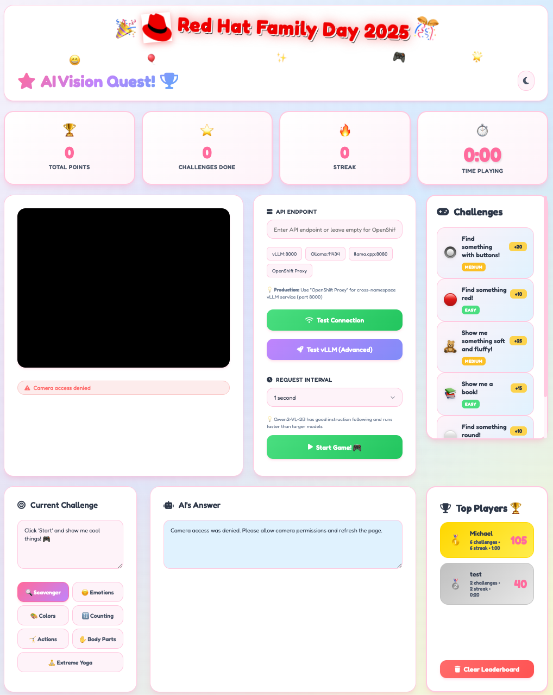

# 🎩 Red Hat Family Day 2025 - AI Vision Quest

An interactive AI-powered vision game for Red Hat Family Day 2025! Kids and families can play fun challenges where they show objects, make faces, and do poses to the camera, and the AI judges whether they succeed.

## 📚 For Kids & Families

**New to the game?** Check out our kid-friendly guides:
- 🎮 **[HOW TO PLAY - Full Guide](guides/HOW_TO_PLAY.md)** - Complete instructions with fun visuals!
- ⚡ **[Quick Guide for Kids](guides/QUICK_GUIDE_FOR_KIDS.md)** - Short & simple one-page version!
- 🖨️ **[Printable HTML Guide](guides/QUICK_GUIDE_FOR_KIDS_PRINTABLE.html)** - Beautiful print-ready version!

Perfect for kids ages 5-10! 🌟

## 🎮 Game Preview



**Features shown:**
- 🎯 Real-time scoring and challenges
- 🤖 AI-powered vision analysis with explanations
- 🏆 Live leaderboard
- 🎨 Beautiful, kid-friendly interface
- ⏱️ Game timer and streak tracking

## 🌟 Features

### 🎮 Multiple Game Modes
- **🔍 Scavenger Hunt** - Find and show objects (books, cups, toys, etc.)
- **😊 Emotions** - Make different facial expressions (happy, surprised, silly)
- **🎨 Colors** - Show colorful objects
- **🔢 Counting** - Show specific numbers of items
- **🤸 Actions** - Do movements (wave, jump, clap)
- **✋ Body Parts** - Show hands, feet, eyes, etc.
- **🧘 Extreme Yoga** - Try fun yoga poses

### 🤖 AI-Powered with Qwen2-VL-2B
- **Smart Vision Model:** Qwen/Qwen2-VL-2B-Instruct (2B parameters)
- **Real-time Processing:** 1-second intervals for fast gameplay
- **Intelligent Judging:** AI explains why it says YES or NO
- **Age-Appropriate:** Prompts tuned specifically for kids ages 5-10
- **Balanced Difficulty:** Encouraging but educational (±1 counting tolerance, color family matching)

### 🏆 Scoring System
- Points for completing challenges
- Streak tracking
- Real-time leaderboard
- Timer to track game duration
- Name entry modal for saving high scores

### 🎨 Beautiful UI
- Colorful, kid-friendly design
- Animated celebrations and confetti
- Dark mode support
- Responsive layout for all devices
- Styled modals with smooth animations (no more basic alerts!)
- Editable prompts during gameplay for real-time tuning

## 🚀 Quick Start

### Option 1: Production Deployment (OpenShift + vLLM)

**Prerequisites:**
- OpenShift cluster
- Red Hat AI Inference Server (vLLM) with Qwen/Qwen2-VL-2B-Instruct
- Cross-namespace networking enabled

**Deploy in 3 steps:**

```bash
# 1. Set environment variables (optional)
export NAMESPACE="family-day"
export VLLM_NAMESPACE="rhaiis"
export CONTAINER_IMAGE="quay.io/rh_ee_micyang/family-day-web-prod:0.1"

# 2. Run deployment script
./deploy-to-openshift.sh

# 3. Open the URL shown and start playing!
```

See [PRODUCTION_README.md](PRODUCTION_README.md) for detailed instructions.

### Option 2: Local Development

**Prerequisites:**
- Python 3 or Node.js (for local HTTP server)
- Ollama or vLLM running locally

```bash
# Start a local server
python -m http.server 8000

# Open browser
open http://localhost:8000
```

See [QUICK_START.md](docs/QUICK_START.md) for detailed setup.

## 📁 Project Structure

```
family-day-2025/
├── 📂 src/                    Source files
│   ├── prod-index.html        🚀 Production game (use this!)
│   └── index.html             Development version
├── 📂 guides/                 Kid-friendly guides (ages 5-10)
│   ├── HOW_TO_PLAY.md
│   ├── QUICK_GUIDE_FOR_KIDS.md
│   └── QUICK_GUIDE_FOR_KIDS_PRINTABLE.html
├── 📂 docs/                   Technical documentation
│   ├── PRODUCTION_DEPLOYMENT.md
│   ├── CONTAINER_DEPLOYMENT.md
│   ├── QUICK_START.md
│   └── ...more docs
├── 📂 scripts/               Automation scripts
│   ├── build-container.sh
│   └── deploy-to-openshift.sh
├── 📂 config/                Configuration files
│   ├── Containerfile
│   └── rhaiis-deployment.yml
├── 📂 assets/                Images and media
│   ├── game.png
│   └── redhat.png
├── CHANGELOG.md              Version history
└── README.md                 You are here!
```

**📖 Each folder has its own README with detailed information!**

## 🎯 How It Works

1. **Select a Challenge** - Click on one of the colorful challenge cards
2. **Start the Game** - Click "Start Game!" button
3. **Show the Camera** - Hold up objects, make faces, or do actions
4. **AI Judges** - The AI analyzes your camera feed every second
5. **Get Points** - Earn points when the AI says YES!
6. **Check Explanations** - See why the AI made its decision
7. **Save High Score** - Enter your name for the leaderboard

## 🤖 AI Response Format

The AI now provides explanations with every decision:

**Example Success:**
```
✅ AI SAYS YES!

YES - I can see a red book being held in the image.

🎉 AWESOME! You earned 15 points!
```

**Example Failure:**
```
❌ AI SAYS NO

NO - I don't see any book in this image, only a hand.

🔍 Keep trying! Show the item/action to the camera.
```

## 🏗️ Architecture

```
┌─────────────────────────────────────┐
│   Web Browser (Family Day App)     │
│   - HTML/CSS/JavaScript             │
│   - Camera capture                  │
│   - Game logic & scoring            │
└────────────┬────────────────────────┘
             │ HTTPS /v1/chat/completions
             │ (Image + Prompt)
             ↓
┌─────────────────────────────────────┐
│   Nginx Proxy (in container)        │
│   - Route /v1/* to vLLM             │
│   - CORS handling                   │
└────────────┬────────────────────────┘
             │ HTTP (internal)
             ↓
┌─────────────────────────────────────┐
│   Red Hat AI Inference Server       │
│   (vLLM on OpenShift)               │
│   - Model: Qwen2-VL-2B-Instruct     │
│   - OpenAI-compatible API           │
│   - Port 8000                       │
└─────────────────────────────────────┘
```

## 🎨 Game Modes & Challenges

### Scavenger Hunt 🔍
Find everyday objects around you!
- Show me a book! (15 points)
- Find something red! (10 points)
- Show me a cup or mug! (15 points)

### Emotions 😊
Show different facial expressions!
- Show me a happy face! (15 points)
- Make a surprised face! (20 points)
- Show me a silly face! (20 points)

### Colors 🎨
Show colorful objects!
- Show me something blue! (10 points)
- Find something green! (10 points)
- What colors do you see? (15 points - open-ended)

### Counting 🔢
Show the right number of items!
- Show me 2 of the same thing! (20 points)
- How many fingers am I holding up? (15 points - open-ended)

### Actions 🤸
Do fun movements!
- Wave hello to the camera! (15 points)
- Give a thumbs up! (10 points)
- Do a silly dance! (25 points)

### Body Parts ✋
Show different body parts!
- Show me your hands! (10 points)
- Point to your eyes! (10 points)
- Touch your ears! (15 points)

### Extreme Yoga 🧘
Try yoga poses!
- Stand like a tree! (25 points)
- Make a star pose! (20 points)
- Do warrior pose! (30 points)

## 🔧 Configuration

### vLLM Settings
- **Model:** Qwen/Qwen2-VL-2B-Instruct
- **Temperature:** 0 (deterministic)
- **Max Tokens:** 100 (for explanations)
- **Request Interval:** 1 second (default)

### API Endpoints
- **Production:** Empty (uses OpenShift proxy)
- **Local vLLM:** http://localhost:8000
- **Ollama:** http://localhost:11434
- **llama.cpp:** http://localhost:8080

## 📊 Model Information

**Qwen/Qwen2-VL-2B-Instruct**
- Parameters: 2 Billion
- VRAM Required: ~4GB
- Inference Speed: Fast (suitable for 1s intervals)
- Instruction Following: ⭐⭐⭐⭐ Excellent
- Vision Quality: ⭐⭐⭐⭐ Very Good
- Best For: Real-time family games, reliable YES/NO responses

## 🎉 Success Features

### Smart Validation
The game uses intelligent validation to award points:

1. **Explicit YES Detection** - "YES - I see a book"
2. **Affirmative Inference** - "You are holding a book" → Points awarded!
3. **Negative Override** - "No book visible" → No points

### Kid-Friendly Design
- Fast 1-second response time
- Clear explanations from AI
- Forgiving validation logic
- Colorful animations and celebrations
- Manual override button for edge cases

## 🤝 Contributing

This is a Red Hat internal Family Day project. For questions or improvements:
1. Test locally with `index.html`
2. Update `prod-index.html` for production
3. Rebuild container with `./build-container.sh`
4. Deploy with `./deploy-to-openshift.sh`

## 📝 License

Internal Red Hat Family Day 2025 project.

## 🎊 Have Fun!

Built with ❤️ for Red Hat Family Day 2025

**Questions?** Check the documentation files or the code comments!

